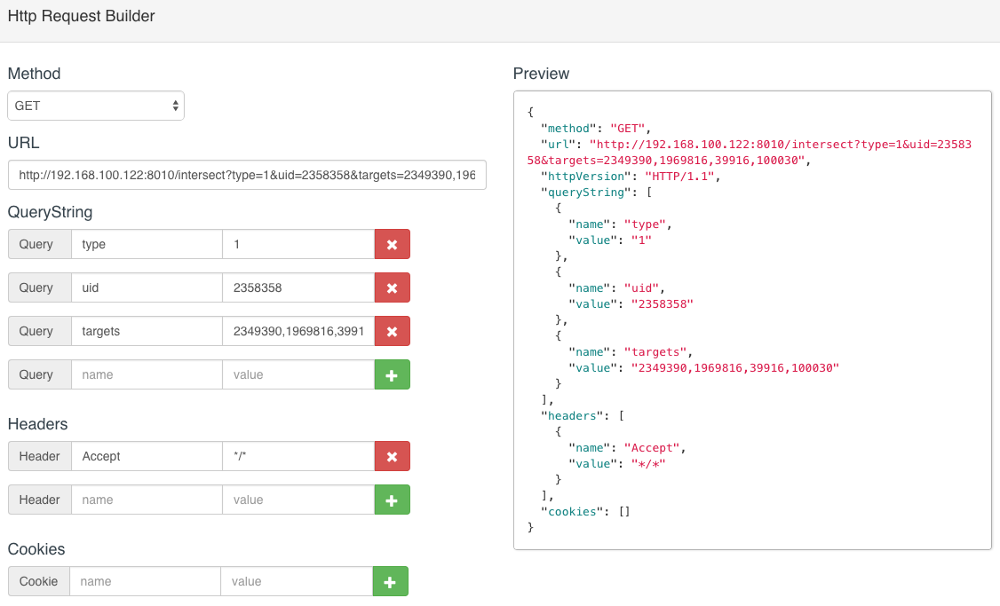
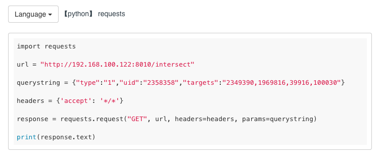

## moklr

moklr定位于http请求代码生成，自动化测试等test/development辅助功能，仍在持续开发中。


### moklr是什么?

moklr取自"mock language request"之意，它最终的形态可能是：

- 取代postman等http api测试工具，方便开发时测试HTTP请求，并提供比postman等更好的易用性
- http client代码生成，不用了解代码知识，只需了解基本的http协议就可以生成各种语言实现的测试代码用例
- 能批量或是单个、定时或是手动执行已经编写或者自动生成的http测试用例，解放双手
- 可能是status服务的初级版本，用于检测主要API的健壮性
- 可能会集成文档功能，自动生成markdown或是html格式的API文档


### 现在的moklr可以做什么?

- 通过填写基本的http协议字段，生成各语言测试代码，目前支持Get/Post方式的http请求
- 下载对应的代码生成本地文件，如python测试用例，直接执行即可出测试结果
- 通过填写http描述字段，模拟http请求测试
- 实现了一个可批量跑http测试用例的worker


### 如何使用?

```
git clone https://github.com/sumory/moklr.git
cd moklr
npm install .
node app.js
#访问http://localhost:8001/mock/create
```

Get请求示例：

- 填写http基本url参数等

	

- 点击"Create Request"
- 生成各语言对应代码，默认显示python实现

	

- 如要保存文件，点击“Download code"即可，比如下载下来的python文件python.py可直接运行，省去测试人员重复性的case编写。
- 若想查看请求结果，也可以直接"Run Test"。


Post请求示例：

post请求在填写http描述时相对复杂，moklr默认已实现
application/x-www-form-urlencoded、multipart/form-data、application/json三种常用的post请求方式。

post操作可参看Get请求示例部分。


