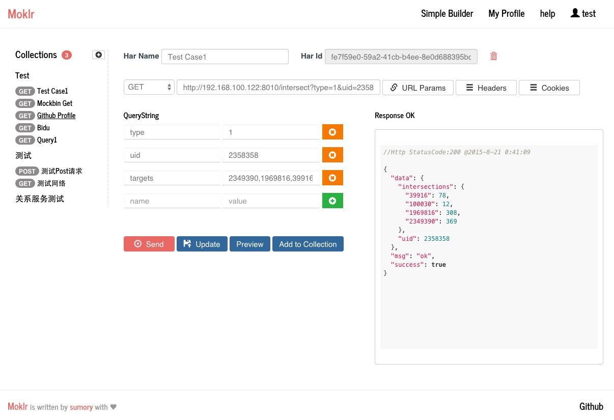

## Moklr

moklr定位于http请求代码生成，自动化测试，API status服务等test/development辅助功能，此外还可能集成文档服务，目前仍在持续开发中。


### Features

- [X] postman替代品，支持postaman数据(collection级别)直接导入
- [X] http请求代码生成，支持常见的多种语言(js/java/go/python/shell/ruby等等)
- [X] API status检查(需[runbot](https://github.com/sumory/runbot)支持)
- [ ] 批量测试case
- [ ] 测试文档和API文档生成


### Usage

1. 依赖于mongodb
2. checkout代码并运行

	```
	git clone https://github.com/sumory/moklr.git
	cd moklr
	npm install .
	#根据具体情况修改config配置
	NODE_ENV=test node app.js
	#访问http://localhost:8001
	```

### Screenshots



